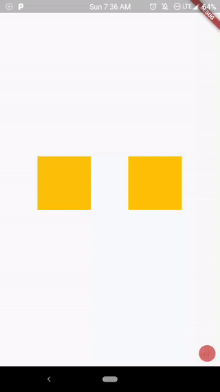

# gesture_boxes_app

A Flutter application demonstrating using an InheritedWidget as a singleton to directly handle state between different areas of the widget render tree (to prevent having to re-render the entire widget tree on a state change).

